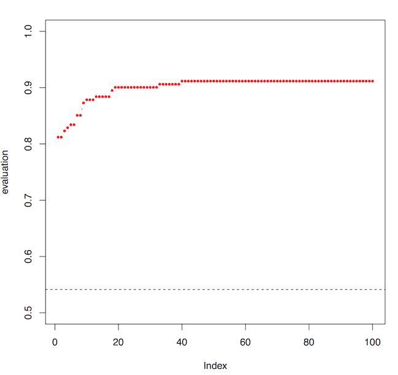

```{r setup, include=FALSE}
knitr::opts_chunk$set(echo = TRUE)
```

# Introduction

## Overview

We introduce here the *predomics* package, which is designed to search for simple and interpretable predictive models from omics data and more specifically metagenomics. These models, called BTR (for Bin/Ter/Ratio) are based on a novel family of languages designed to represent the microbial interactions in microbial ecosystems. Moreover, in this package we have proposed four different optimization heuristics to find some of the best predictive models. A model in *predomics* is a set of indexes from the dataset (i.e. variables) along with the respective coefficients belonging to the ternary set `{-1, 0, 1}` and an intercept of the form `(A + B + C - K - L - M < intercept)`. The number of variables in a model, also known as *model size*, *sparsity* or *parsimony*, can vary in a range provided as a parameters to the experiment. 

In *predomics* we have impemented the following types of object:

- `model`, which can be tested with `isModel()`, is a list which contains information on the features, the languages, the fitting scores etc.
- `population of models`, which can be tested with `isPopulation()` is a list of `model` objects.
- `model collection`, which can be tested with `isModelCollection()` is a list of `population` objects. They are grouped by model size.
- `classifier`, which can be tested with `isClf()` is a set of parameters which defines a learner ready to be run.
- `experiment`, which can be tested with `isExperiment()` is a top level object which contains a `classifier` object along with the learned models organized as a `model collection` object.

All these objects can be viewed with the `printy()` function. Other existing functions allow conversion from one object type to the other as for instance `modelCollectionToPopulation()`. An experiment can be explored using the `digest()` routine along with many other functions implemented in more than 18K lines of code.

## Heuristics

In this package we have proposed four different heuristics to search for the best predictive models.

- **Terga1 and terga2**. These algorithms are based on genetic algorithms. Here we introduce the notion of a population of models, which is a set of individuals/models that can be mutated, crossed, evolved and selected for many generations (epochs). The main difference between *terga1* and *terga2* is that the former will evolve individuals of a fixed model-size, while the latter can evolve models of different model-size in larger populations. There are also other differences in the core of these algorithms but that we will not discuss here. 
- **Terbeam**. This algorithm consists of using a beam search approach. In computer science, beam search is a heuristic search algorithm that explores a graph by expanding a subset of the most promising node. Beam search is an optimization of best-first search that reduces its memory requirements. Here we use a window of a given size `(a, b)` for two consecutive model-size `(k, k+1)`. The best models of model-size `k` are used to generate combinations of model-size `k+1` and the best ones are kept for the next round. The size of the windows is fixed in parameters at the beginning of the experiment. The results can be also considered as a population of models.
- **Terda**. This algorithm is based on a standard logistic regression approach. After learning a linear model with real-valued weights with the GlmNet package, these weights are rounded to either `{-1, 0, 1}`. 
- **Metal**. The four algorithms presented above complement each other in terms of model space epxloration. For instance, *terbeam* is specialized in small models, *terda* in bigger ones and *terga* will make sure to explore random combinations that are not only composed of features which in smaller-sparisty settings yield good results. We devised another algorithm named *metal* (fusion), which is a meta-heuristic based on the *terga2* engine. The initial population is seeded by sets of models found by either *terbeam*, *terda* or *terga2* and is next combined and evolved together. Metal has also the capacity to evolve models with multiple languages in the same time. This is particularly of interest when we wish to discover automatically the set of rules that predicts best the studied condition.

## Predomics languages
A *predomics* model is coded in R as a S3 object, which contains a certain number of attributes among which the `learner` (algorithm) that generated it but also the `language` that is used. The languages we have proposed in the current version are the following.

- **Bin/bininter**. Let us take the following exemple `(A + B + C < intercept)`. In a *bin/bininter* language we have only two coefficients from the binary set `{0, 1}`. Features that do not appear in the model have the coefficient `0` while the others have the coefficient `1`. The difference between *bin* and *bininter* is that the intercept for the former is set to zero. In this tutorial we will consider *bin* and *bininter* as the same language and will search for *bininter*, which encompasses *bin*.
- **Ter/teriter**. If we take the example above `(A + B + C - K - L - M < intercept)` we can see that in this model of size `k=6`, we have coefficients from the ternary set `{-1, 0, 1}`. Features that do not appear in the model have the coefficient `0` while the others have `1` or `-1`. Models that have only positive or only negative coefficients are not considered as they would be *bin* models. The difference between *ter* and *terinter* is that the intercept for the former is set to zero. In this tutorial we will consider *ter* and *terinter* as the same language and will search for *terinter*, which encompasses *ter*.
- **Ratio**. In the ratio language the intercept plays the role of a multiplication factor and the model is the form `(A+B+C)/(K+L+M) < intercept`.
- **State of the art (SOTA)**. We have implemnted in *predomics* three state-of-the-art algorithms used today in the field of metagenomics, random forest *(rf)*, support vector machines *(svmlin, svmrad)*, respectively using a linear and a radial kernel and finally the Elastic-Net Regularized Generalized Linear Models *(glmnet)*. Most of the parameteres of these algorithms are left by default and some are optimized using internal cross-validation techniques.

# Getting started

## Installing and loading `predomics`
`predomics` package is available on Integromics' GitLab and can be installed on your computer through the following instructions. For this first is needed the `devtools` package if not already installed. Finally the package will be loaded to be used.

```{r install packages, eval=FALSE, message=F, warning=FALSE, include=FALSE, paged.print=TRUE}
# Load "devtools" library (install it if needed)
ip <- installed.packages()

if(!("devtools" %in% rownames(ip)))
{
  install.packages("devtools", dependencies = TRUE)
}

if(!("predomics" %in% rownames(ip)))
{
  # dependencies from bioconductor
  if (!require("BiocManager", quietly = TRUE)) install.packages("BiocManager")
  BiocManager::install("BioQC")
  
  # install predomics
  library(devtools)
  install_github("predomics/predomicspkg")
}
rm(ip)
```

```{r load the packages, message=FALSE, warning=FALSE}
# load the library
library(predomics)
library(tidyverse)
library(gridExtra)
library(pROC)
library(reshape2)
```

## Preparing the data
In this example we use 6 datasets provided with the package `data(package = "predomics")`. 

- cir_test              Cirhosis stage 2 (frequencies)
- cir_train             Cirhosis stage 1 (frequencies)
- ibd                   Inflammatory Bowel Disease (frequencies) from the MetaHIT study
- obesity               Obesity (frequencies) from the MetaHIT study
- t2d                   Type 2 diabetes (frequencies) BGI
- t2dw                  Type 2 diabetes (frequencies) Women Sweden

Each is a list containing a data matrix `X` (with features in the raws and observations in the columns) and a vector `y` with information on the classes to predict. The dataset we will use here is cir_train which comes from the liver cirrhoses study (`?cir_train` for more information). 

In `predomics` we provide several functions that allow to filter the initial data and avoid learning from variables with little information. The most commonly used function is `?filterNoSignal`, which will compute the first derivate of the `median(sd)/x` and will find an automatic threshold. Other filtering procedures are also implemented as for instance `?filterFeaturesByPrevalence`, which selects variables based on their minimal prevalence or `?filterfeaturesK`, which selects the `k` most significant features with the class. The reader is invited to explore the documentation for more information.

```{r loading filtering the data, message=FALSE, warning=FALSE, paged.print=FALSE}
# load the data
data("cir_train")
str(cir_train, max.level = 1)

# Filter the non informative variables
X <- cir_train$X; y <- cir_train$y # set global variables
X <- X[rowSums(X)!=0,]; dim(X) # filter out variables with only zero values
X <- filterNoSignal(X = X, side = 1, threshold = "auto", verbose = FALSE); dim(X) 
```

## Setting the learner context
Now that the dataset is ready, we need to prepare the learner context. This is the `classifier` object mentioned previsously. Eeach learning algorithm we have proposed here, `?terga1`, `?terga2`, `?terbeam`, `?terda` and `?metal`, has its own parameters, which can be explored by running `?terga2`. In this example we will use the default parameters and set only `nCores = 1`. If nCores > 1 the execution will run in parallel. We have optimized the parallel execution to take full advantage of the computational ressources and typically it will run each cross-validation fold in one CPU. A deeper paralelization will waste ressources in the serialization process. Finally, we set the `seed = 1` (if multuple seeds are provided, the algorithm will run multiple times). When `plot = TRUE` graphics with the evolution process are provided in pdf format.

```{r setting the classifier}
# Terga2
clf <- terga2(nCores = 1,
              seed = 1,
              plot = TRUE
)
printy(clf) # print the object for more information
isClf(clf)  # test whether the object is a classifier
class(clf)  # the class of the classifier object
```


## Running the learner experiment
After setting the classifier, we can run the learning experiment. For this we simply run `?fit()` along with `X`, `y` and `clf` as specified in the code below. The algorithm logs out details on the execution steps (each dot corresponds to a generation (i.e. an iteration of the genetic algorithm) and each line to a cross-validation step, including the first which is the learning in the whole dataset).

```{r running experiment, echo=TRUE, fig.width=5}
runit = TRUE
if(runit)
{
  res_clf <- fit(X = X, y = y, clf = clf, cross.validate = TRUE, nfolds = 10); # class(res_clf)
  # save results
  save(res_clf, clf, file = "cirrhosis1_res_clf_terga2.rda", compression_level = 9)
}

# ... Database X is not a matrix! Converting ...
# ... Classification mode, computing factor(y) for speedup and robustness
# ... Loading feature correlation for speedup
# ... Correlation file loaded
# ... Storing data in the classifier object for speedup
# ... Computing ternary coefficients for speedup
# ... One seed found, setting by default
# ... Running the classifier terga2 with a single CPU
# ... Second and faster version of terga fitting based on Genetic Algorithm heuristics ...
# ... Cross validation mode
# ... Starting cross validation not in parallel
# ....................................................................................................
# ....................................................................................................
# ....................................................................................................
# ....................................................................................................
# ....................................................................................................
# ....................................................................................................
# ....................................................................................................
# ....................................................................................................
# ....................................................................................................
# ....................................................................................................
# ....................................................................................................
# ... Learning process is finished succesfuly
# ... Thank you for using Predomics. Don't forget to digest the results now.
# 
# [1] "experiment" "predomics" 
```

The evolution of the accuracy of the best model during the 100 generations is displayed below. We can observe that it evolves during the first 40 generations and then it remains stable probably suggesting that one of the best solutions was found. The algorithm can stop if convergence is attained for a given number of epochs.



## Exploring the results
```{r load results, message=FALSE, warning=FALSE, include=FALSE, paged.print=FALSE}
if(!runit)
{
  load("cirrhosis1_res_clf_terga2.rda")
}
```

The resulting `experiment` object is a list composed of two elements. The first is the previous `classifier` object augmented with 7 additional elements:

1. `feature.cor`: contains statistics on the variables such as p-value, q-value and enrichnment class
2. `data`: is a list containing the names of the features along with X, y
3. `coeffs_`: contains the coeffcients `{-1,1}` set for each feature as determined on the whole dataset
4. `lfolds`: is a list of observation indexes that are used in the test datasets during the cross-validation process
5. `models`: is a model collection object, containing for each model size all the models that are learned. Some of these models can be bad models as this is a genetic algorithm
6. `fip`: is a list containing information on the feature importance and prevalence during the cross validation.
7. `execTime`: the time in minutes it was needed to run the experiment in the whole dataset. The time for each fold is similar or smaller knowing that there are less examples to compute.

The second element is `crossVal` and contains results from the cross-validation process. This element is not available when the experiment was not run in cross-validation mode. It is composed the following elements:

1. `nfold`: this element will be empty when option `return.all = FALSE` in the `fit()` routine, otherwise it will contain all the data from each cross-validation fold.
2. `k`: contains three data-frames that for each model size will provide for *auc*, *accuracy* and *cor*  the average performance for the training and testing sets during the cross-validation.
3. `scores`: contains raw tables with performance by model-size and cross-validation folds.
4. `fip`: contains raw data for each fold on feature prevalence and importance

### Digesting the results
In the `predomics` package we have provided a wealth of functions that allow exploring the results of a single experiment, but also to compare multiple experiments together. The most important function is `?digest`. We specify the experiment object as well as the model-size `penalty` coefficient. This function will return a list containing the best model, the list of best models for each model-size as well as summarized performance information during the cross-validation process.

1. `learner`: the name of the learning algorithm.
2. `best`: contains a list which provides the best overall model, a population of models with the best model for each model-size and a list of scores with the best performance for each model size.
3. `cv`: contains similar information from the `crossVal` element of the main experiment.

By running the `digest()` function we can easily explore the performance in cross-validation and empirical setting as illustrated by the figure below.

```{r digesting results, fig.height=10, fig.width=7, message=FALSE, warning=FALSE, paged.print=FALSE}
res_clf.dig <- digest(obj = res_clf, penalty = 0.75/100, plot = TRUE)
```


### Visualizing the best model
The best model that is learned can be visualized by simply priting it along with summarized information on performance and model size. Moreover, we can explore the model further by visualizing it using the barcode plot `?plotModel`. Finally, the importance of each feature can be also displayed using the same function as illustrated in the figure below. 

```{r best model, fig.width=7, warning=FALSE}

# get the best model
best.model <- res_clf.dig$best$model
printy(best.model)
grid.arrange(plotModel(best.model, X, y, sort.features = FALSE, feature.name = TRUE),
             plotModel(best.model, X, y, sort.features = FALSE, feature.name = TRUE, importance = TRUE),
             ncol=2)
```

### Testing the model in another dataset
Now, let us test this model in another dataest with cirrhois patients `?cir_test`. For this, we need to work in the same space of features as the one we have worked with until now. The accuracy of the model in the training dataset is 0.895, while in the test dataset it is 0.8393.

```{r validate model in cir_test}
data("cir_test")

X.test <- cir_test$X[rownames(X),]
all(rownames(X) == rownames(X.test)) # test ordering
y.test <- cir_test$y

best.model.test <- evaluateModel(mod = best.model, X = X.test, y = y.test, clf = clf, eval.all = TRUE, force.re.evaluation = TRUE, mode = "test")
printy(best.model.test)
```

### Visualizing model performance AUC
The model performance can be visualized using the `?plotAUC` function which uses the pROC package toolset. It also provides the confidence interval of the area under the curve for the Receiver Operating Characteristic analysis. We can also compare multiple models in one using `?ggroc` form the *pROC* package. For this we need to create roc objects for each model and list them together before the plot. Noteworthy the performance of the model in the test dataset is with the confidence interval of the first plot below.

```{r roc analyses, fig.height=7, fig.width=7, message=FALSE, warning=FALSE, paged.print=FALSE}
tmp <- plotAUC(best.model$score_, y, percent = TRUE); rm(tmp)

# create the roc objects
rocobj.train <- roc(y ~ best.model$score_)
rocobj.test <- roc(y.test ~ best.model.test$score_)

# make the plot
ggroc(list(train = rocobj.train, test = rocobj.test))
```

### Family of Best Models (FBM)
A family of best models is defined as the set of models returned by the predomics algorithm, whose accuracy is within a given window of the best model's accuracy. This window is defined by computing a significance threshold assuming that accuracy follows a binomial distribution (p<0.05). An FBM can be analyzed in detail to distill biological information in the predictive context. First, we pool all the models together from the experiment object with `?modelCollectionToPopulation`. A population of 192 models is obtained, which can be transformed with `?populationToDataFrame` onto a dataframe for further exploration. Next we select the FBM composed of 159 models with `?selectBestPopulation`. The figure below displays the accuracy distribution by model-size before and after selection.

```{r family of best models, fig.height=3.5, fig.width=7, message=FALSE, warning=FALSE}

# get the population of models scrambled by model size
pop <- modelCollectionToPopulation(res_clf$classifier$models)
printy(pop)
pop.df <- populationToDataFrame(pop)
head(pop.df[,-c(3,4,7,8,14)])
pop.df.melt <- melt(pop.df, id.vars = c("accuracy_","eval.sparsity"))

g.before <- ggplot(data = pop.df.melt, aes(y = accuracy_, x = eval.sparsity)) + 
  geom_boxplot(notch = FALSE, outlier.shape = " ", position = position_dodge(width=0.9), alpha = 0.3) + 
  geom_point(aes(color = eval.sparsity), position=position_jitterdodge(dodge.width=0.9), size = 1, alpha = 0.5) +
  ylim(c(0,1)) +
  xlab("Model parsimony") +
  ggtitle("Original population") +
  theme_bw() +
  theme(legend.position="bottom", legend.direction="horizontal") +
  guides(colour="none")

# select the best 
fbm <- selectBestPopulation(pop)
printy(fbm)
fbm.df <- populationToDataFrame(fbm)
fbm.df.melt <- melt(fbm.df, id.vars = c("accuracy_","eval.sparsity"))#; head(fbm.df.melt)

g.after <- ggplot(data = fbm.df.melt, aes(y = accuracy_, x = eval.sparsity)) + 
  geom_boxplot(notch = FALSE, position = position_dodge(width=0.9), alpha = 0.3) + 
  geom_point(aes(color = eval.sparsity), position=position_jitterdodge(dodge.width=0.9), size = 1, alpha = 0.5) +
  ylim(c(0,1)) +
  xlab("Model parsimony") +
  ggtitle("FBM") +
  theme_bw() +
  theme(legend.position="bottom", legend.direction="horizontal") +
  guides(colour="none")

grid.arrange(g.before, g.after, ncol =2)
```

Analyzing the FBM can be very informative to discover the most important variables in the prediction process. Let us first see the usage of variables in the FBM models. We run for this the `?makeFeatureAnnot` function to obtain the feature distribution in the model matrix, which is the `pop.noz` element. The models in the FBM are ordered by accuracy and the same order will be propagated in the coefficient dataframe. There are 44 features found in the FBM models. The figure below indicates that some of these features are very prevalent in the FBM, which are likely important. The abundance and prevalence distribution of these features can ve explored with `?plotAbundanceByCalss` and `?plotPrevalence` respectively. Gray stars on the right side of the graphics indicate significat differences between prediction groups.

```{r feature exploration, fig.height=7, fig.width=7, message=FALSE, warning=FALSE, paged.print=FALSE}
fa <- makeFeatureAnnot(pop = fbm, 
                       X = X, 
                       y = y, 
                       clf = clf)
dim(fa$pop.noz)
(g1 <- plotFeatureModelCoeffs(feat.model.coeffs = fa$pop.noz))
(g2 <- plotAbundanceByClass(features = rownames(fa$pop.noz), X = X, y = y))
(g3 <- plotPrevalence(features = rownames(fa$pop.noz), X = X, y = y))

```

### Feature importance
Finally, we can explore the feature importance using mean decrease accuracy information computed during the cross-validation process. It is worth noting that the order of variables based on the prevalence in FBM, is concordant with the order of mean decrease accuracy (i.e. importance) in the cross-validation. But when we look at the variables based on their importance indipendetly on the empirical learning FBM, the picture changes somewhow. There are some important variables that were not selected in the FBM of the whole dataset. It is thus important to explore the cross validation importance.

```{r fig.height=7, fig.width=7, message=FALSE, warning=FALSE, paged.print=FALSE}
feat.import <- mergeMeltImportanceCV(list.results = list(terga2 = res_clf), 
                                     filter.cv.prev = 0, 
                                     min.kfold.nb = FALSE, 
                                     learner.grep.pattern = "*", 
                                     #nb.top.features = 50, 
                                     feature.selection = rownames(fa$pop.noz),
                                     scaled.importance = TRUE,
                                     make.plot = TRUE, 
                                     cv.prevalence = FALSE)
feat.import$g

feat.import <- mergeMeltImportanceCV(list.results = list(terga2 = res_clf), 
                                     filter.cv.prev = 0, 
                                     min.kfold.nb = FALSE, 
                                     learner.grep.pattern = "*", 
                                     nb.top.features = 50, 
                                     #feature.selection = rownames(fa$pop.noz),
                                     scaled.importance = TRUE,
                                     make.plot = TRUE, 
                                     cv.prevalence = FALSE)
feat.import$g
```


## Session Info

```{r}
sessionInfo()
```
